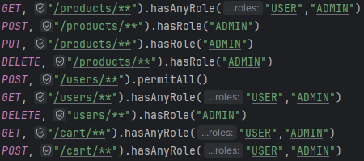

# Java Spring Boot Microservices E-Shop Project
(Eureka Server, Spring Cloud API Gateway, Spring Security(JWT, Authentication, Authorization), RabbitMQ, PostgreSQL, Docker, etc.)

# About the project

<ul style="list-style-type:disc">
  
  <li>Guest(No Auth) can register and login through user service by user role (ADMIN or USER) through api gateway</li>
  <li>Admin/User can send any request to relevant service through api gateway with its bearer token</li>
  <li>Admin can delete user/product, then all data associated with this user/product will be deleted from cart(via RabbitMQ messaging)</li>
</ul>

### Project Stack Dependencies

* Core
    * Spring
        * Spring Boot
        * Spring Security
            * Spring Security JWT
            * Authentication
            * Authorization
        * Spring Web
        * Spring AMQP(RabbitMQ)
        * Spring Data
            * Spring Data JPA
            * PostgreSQL
        * Spring Cloud
            * Spring Cloud Gateway
    * Netflix
        * Eureka Server
        * Eureka Client
* Database
    * PostgreSQL
* Hibernate ORM
* Docker
    * Docker Compose
* Validation
* Swagger(Springdoc OpenAPI)
* Lombok
* Tests
  * JUnit
  * Mockito

## Application default configuration
| Service               | Port |
|-----------------------| --   |
| api-gateway           | 8085 |
| discovery-service     | 8084 |
| user-service          | 8082 |
| cart-service          | 8081 |
| product-service       | 8080 |

## Default Endpoints Security 



## Running the app with Docker

Download/clone sources and run:
```bash
docker compose up -d
```
SwaggerUI for all services is available on API Gateway here : [localhost:8085/documentation/swagger-ui.html](http://localhost:8085/documentation/swagger-ui.html)

Request endpoints through API Gateway with Postman, Insomnia, etc.
    
